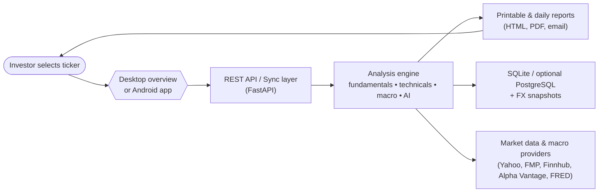

# BD Finance Stock Evaluator

## Executive Summary
BD Finance Stock Evaluator delivers an end-to-end investing assistant that blends quantitative ratios, technical momentum, macro trends, qualitative moat scoring, AI commentary, portfolio automation, and cross-platform experiences. The project now satisfies every Epic in the V2 roadmap: the Python backend powers global market coverage, printable reports, automation jobs, and APIs; the Streamlit desktop overview and native Android client keep investors in sync; containerised deployment and documentation make it trivial to operate in production or share with non-technical stakeholders.

## Highlights by Epic
- **Epics 1 & 2 – Data Foundation & Fundamentals:** Multi-provider ingestion (Yahoo, FMP, Finnhub, Alpha Vantage) with automatic FX normalisation backs a rich valuation, profitability, growth, and intrinsic value engine exposed through reusable Python modules.
- **Epic 3 – Technical & Momentum Toolkit:** MACD, RSI, ADX, Bollinger Bands, multi-period SMAs, trendline detection, and performance metrics feed both the backend scoring and interactive Streamlit charts.
- **Epic 4 – Macro Context:** Daily/weekly/monthly macro series from FRED populate a macro dashboard with recession signals, sentiment overlays, and alignment against company fundamentals.
- **Epic 5 – Qualitative & Moat Evaluation:** AI-assisted moat scoring, ownership trend analysis, and management quality summaries complement hard metrics.
- **Epic 6 – Portfolio & Automation:** CSV/Excel import, performance analytics, watchlist alerts, automated daily report generation, and PDF/email artefacts provide portfolio-wide visibility.
- **Epic 7 – UX & Platform Integration:** Streamlit desktop overview with Chart Explorer, printable WeasyPrint/PDFKit reports, a sync-ready REST payload, and a Kotlin/Compose Android client now operate in lockstep.
- **Epic 8 – AI & Automation Layer:** Groq/Gemini powered summaries, natural-language prompts, and scheduled commentary jobs plug into the same analysis payloads.
- **Epic 9 – Architecture & Infrastructure:** Modular core packages (`bd_finance_core`, `bd_finance_report`), multiple storage backends (SQLite/PostgreSQL), and an API gateway support scalable deployments.
- **Epic 10 – Global Markets & UX Refinements:** International ticker suffix support, FX conversions, and flowchart legibility improvements make worldwide coverage seamless.
- **Epic 11 – Containerisation:** A production-ready Dockerfile, optional `docker-compose`, health checks, and documentation enable consistent, repeatable deployment with or without a local Docker engine.

## System Overview
- **Python Backend (`src/bd_stockevaluator`)** – FastAPI + Flask, modular analysis services, scheduled jobs, reporting pipeline, AI integration, SQLite persistence, and optional PostgreSQL hooks.
- **Streamlit Desktop Overview (`src/bd_stockevaluator/desktop`)** – Fundamentals/technicals/macro tabs, Chart Explorer, downloadable HTML/PDF one-pagers, and sync payload visualisation.
- **Reporting & Automation (`src/bd_stockevaluator/reports`)** – Daily report orchestration, portfolio automation, and export utilities.
- **Android Client (`android-client`)** – Kotlin/Compose app with Hilt, Retrofit, Room, and Material 3 theming consuming the REST API.
- **Containerisation Assets** – Multi-stage Dockerfile, optional compose file, runtime toggles, and health endpoints for operations teams.

## Getting Started
### 1. Prerequisites
- Python 3.12+ (use the supplied `.python-version` if you work with `pyenv`)
- Node-free; all UIs are Python/Android.
- (Optional) Docker 24+ for container builds.
- API keys for providers (store in `.env` or `config/api_keys.txt`).

### 2. Backend Setup
```bash
python -m venv .venv
. .venv/Scripts/activate  # PowerShell on Windows
pip install --upgrade pip
pip install -r requirements.txt
```

Launch the API (all platforms can share it):
```bash
uvicorn bd_stockevaluator.api.main:app --host 0.0.0.0 --port 8000
```
Health check: `http://localhost:8000/health`

To view the legacy Flask UI:
```bash
python src/bd_stockevaluator/app.py
# visit http://localhost:5000
```

### 3. Streamlit Desktop Overview
```bash
streamlit run -m bd_stockevaluator.desktop.overview
```
The app provides fundamentals, technicals, macro context, Chart Explorer, and downloadable reports for any ticker list.

### 4. Android Client
1. Open `android-client` in Android Studio.
2. Set `API_BASE_URL` (in `build.gradle.kts`) to an address your device can reach (`http://192.168.x.x:8000/`).
3. If running on an emulator, `10.0.2.2` points to the host. For physical devices, ensure both phone and backend host share a network.
4. Build & run: `./gradlew assembleDebug` then install the APK.

### 5. Docker Deployment
Build a minimal runtime image (installs only `requirements.docker.txt`):
```bash
docker build -t bd-finance:runtime .
docker run -p 8000:8000 bd-finance:runtime
```
Use the full dependency set:
```bash
docker build -t bd-finance:full --build-arg FULL_REQUIREMENTS=1 .
```
Add `GITHUB_TOKEN` when needed so pip can access private repos. Health endpoint: `GET /health`.

Optional `docker-compose.yml` (if present) provides one-command bring-up with `docker compose up`.

## Portfolio Automation & Reporting
- **Daily Report (`src/bd_stockevaluator/reports/daily_report.py`)** – Generates market snapshots, holdings summaries, automated emails, and portfolio PDFs.
- **Printable Reports (`src/bd_stockevaluator/reports/per_ticker.py`)** – Compose per-ticker summaries and render via WeasyPrint (preferred) or PDFKit fallback.
- **Portfolio Automation (`src/bd_stockevaluator/reports/portfolio_automation.py`)** – Creates performance dashboards, alert lists, and macro overlays; integrates with the daily report workflow.

## Global Market Support
- The data pipeline understands multi-exchange ticker suffixes, fetches native currency OHLC data, and stores canonical exchange/currency metadata.
- FX conversions standardise metrics to USD/EUR while retaining local-currency context. Provider precedence and fallback logging ensure resilience.
- Flowchart rendering improvements (automatic wrapping, accessibility-friendly colours) keep decision paths readable even for long international labels.

## AI & Automation Features
- Opinion summaries from Groq/Gemini, natural-language screening, and scheduled commentary jobs surface qualitative insights alongside core metrics.
- Watchlist alerts and background schedulers (WorkManager/cron) keep both Android and desktop users informed automatically.

## Testing & Quality
```bash
# Run the full Python test suite
pytest

# Lint & format
ruff check .
black .
```
Specific suites (e.g., `tests/test_epic7_streamlit_app.py`, `tests/test_epic7_sync_layer.py`) verify new epics such as Chart Explorer and sync payloads.

## Data Sources & Credentials
- `.env` or `config/api_keys.txt` supports keys such as `api_key_aistudio_google`, `FRED_API_KEY`, `api_key_fmp`, `groq_api_key`, etc.
- The backend gracefully handles missing providers, logging fallbacks and surfacing the active data provider in API responses.

## Project Roadmap Status
All epics from 1 through 11 are implemented. The repository now includes global market support, enhanced UX across desktop and Android, robust reporting, AI copilots, and container-ready assets-bringing BD Finance Stock Evaluator to a production-quality, investor-friendly solution.

## How the Platform Flows (Audience: Everyone)


The reader journey is straightforward: an investor requests a ticker from any interface, the shared analysis engine enriches it with provider and macro data, and both in-app insights and printable summaries reflect the same numbers.

## Technical Architecture Diagram (Audience: IT Teams)
```mermaid
flowchart TB
    subgraph Clients
        ST[Streamlit desktop]
        AND[Android (Compose)]
        Jobs[CLI jobs & schedulers]
    end

    subgraph Backend["Python backend"]
        API["FastAPI REST / sync endpoints"]
        Flask["Flask single-ticker UI"]
        Service["StockAnalysisService\nSync payload builder"]
        ReportsMod["Reporting & automation modules"]
        Portfolio["Portfolio & watchlist services"]
        DataStore["SQLiteDataStore / FX cache"]
    end

    subgraph Providers["External services"]
        MultiSource["MultiSourceDataClient\n(Yahoo, FMP, Finnhub, Alpha Vantage)"]
        Macro["MacroContextService\n(FRED + CSV fallbacks)"]
        AIEngines["Groq / Gemini AI"]
    end

    subgraph Operations
        Docker["Docker image & healthcheck"]
        CI["CI pipelines\npytest • lint • image build"]
    end

    ST --> API
    AND --> API
    Jobs --> ReportsMod
    API --> Service
    Flask --> Service
    Service --> ReportsMod
    Service --> Portfolio
    Service --> DataStore
    Service --> MultiSource
    Service --> Macro
    Service --> AIEngines
    ReportsMod --> DataStore
    Docker --> API
    Docker --> Flask
    CI --> Docker
```

This perspective emphasises the modular boundaries: clients only communicate through the API, the analysis service orchestrates providers and storage, and operations teams rely on container and CI assets for predictable deployments.
