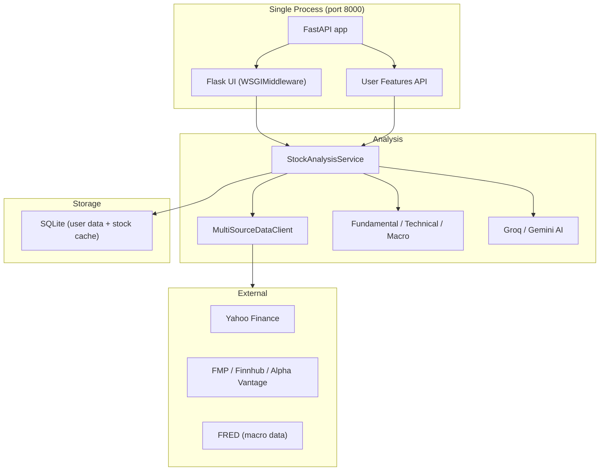

# BD Finance Stock Evaluator

AI-powered stock analysis combining fundamental ratios, technical momentum, macro context, qualitative moat scoring, and LLM commentary — served through a single unified web application.

## Quick Start

```bash
# 1. Install dependencies
uv sync --extra dev          # or: pip install -r requirements.txt

# 2. Configure environment
cp .env.example .env         # then fill in API keys

# 3. Run (development)
FLASK_DEBUG=1 uvicorn bd_stockevaluator.api.main:app --reload --port 8000

# 4. Open http://localhost:8000
```

Everything is served from **port 8000**: the Flask web UI, FastAPI endpoints, and interactive API docs at `/docs`.

## Architecture

Flask is mounted inside FastAPI via `WSGIMiddleware`, running as a single process on port 8000.

```
http://localhost:8000
├── /              Flask web UI (search, evaluate, results)
├── /evaluate      HTMX partial endpoint
├── /api/search    Ticker autocomplete
├── /health        Health check
├── /docs          Swagger UI (FastAPI)
├── /user/...      User features API (watchlist, portfolio, screener, sentiment, patterns)
└── /analyze/...   Analysis API endpoints
```



## Prerequisites

- **Python 3.12+** (see `.python-version`)
- **uv** (recommended) or pip
- API keys for at least one LLM provider (Groq or Gemini) — see `.env.example`
- (Optional) Docker 24+ for container builds

## Environment Variables

All variables are documented in **`.env.example`**. Key ones:

| Variable | Required | Description |
|----------|----------|-------------|
| `SECRET_KEY` | Production | Flask session secret (dev auto-generates one when `FLASK_DEBUG=1`) |
| `GROQ_API_KEY` | For AI reports | Groq LLaMA — primary LLM |
| `GEMINI_API_KEY` | Fallback | Google Gemini — fallback LLM |
| `FRED_API_KEY` | Optional | Federal Reserve macro data |
| `FLASK_DEBUG` | No | `1` for dev mode, `0` (default) for production |
| `CORS_ORIGINS` | No | Comma-separated allowed origins (default: `*`) |

## Running

### Development

```bash
# With uv (recommended)
FLASK_DEBUG=1 uv run uvicorn bd_stockevaluator.api.main:app --reload --port 8000

# With pip
FLASK_DEBUG=1 uvicorn bd_stockevaluator.api.main:app --reload --port 8000

# Module entry point (also launches the unified app)
FLASK_DEBUG=1 python -m bd_stockevaluator
```

### Streamlit Desktop Overview (Optional)

The Streamlit app is a separate desktop tool for interactive charts and report downloads. It runs independently on port 8501:

```bash
uv run streamlit run src/bd_stockevaluator/desktop/overview.py
```

### Docker

The Dockerfile uses a multi-stage build with a non-root user, curl-based healthcheck, and gunicorn with uvicorn workers.

```bash
# Build
docker build -t bd-stockevaluator .

# Run (SECRET_KEY is required)
docker run --rm -p 8000:8000 \
  -e SECRET_KEY=your-secret-here \
  -e GROQ_API_KEY=your-key \
  bd-stockevaluator
```

Or with docker-compose:

```bash
# Requires SECRET_KEY in .env or environment
docker-compose up -d
```

The container runs: `gunicorn -c gunicorn.conf.py bd_stockevaluator.api.main:app` (2 uvicorn workers, 120s timeout, port 8000).

For the full desktop dependency set: `docker build --build-arg FULL_REQUIREMENTS=1 -t bd-stockevaluator:full .`

### Android Client

1. Open `android-client` in Android Studio
2. Set `API_BASE_URL` in `build.gradle.kts` to your server address (e.g., `http://192.168.x.x:8000/`)
3. Build: `./gradlew assembleDebug`

## Security

- **Ticker validation**: Regex `[A-Z0-9.\-^]{1,12}` on all entry points
- **LLM output sanitization**: `bleach` strips unsafe HTML before rendering
- **CORS**: Configurable via `CORS_ORIGINS`; `allow_credentials=False` with wildcard origins
- **SECRET_KEY enforcement**: Required in production; `RuntimeError` on startup if missing
- **CSV upload limit**: 5 MB max; SQL column allowlist for updates
- **Error masking**: Internal errors return generic 502s in production

## Testing

```bash
# Full suite
uv run pytest tests/ -v --tb=short

# With coverage
uv run pytest tests/ --cov=bd_stockevaluator

# Single file
uv run pytest tests/test_specific.py -v
```

## Features

- **Multi-provider data**: Yahoo Finance, FMP, Finnhub, Alpha Vantage with automatic fallback
- **Fundamental analysis**: Valuation ratios, profitability, growth, intrinsic value (DCF)
- **Technical analysis**: MACD, RSI, ADX, Bollinger Bands, SMAs, trendlines, candlestick patterns
- **Macro context**: FRED data, recession signals, sentiment overlays
- **AI commentary**: Groq/Gemini opinion summaries and natural-language screening
- **Portfolio management**: CRUD, CSV import, performance tracking (via API)
- **Watchlist**: REST API with anonymous client-ID auth
- **Sentiment analysis**: News sentiment scoring
- **Global markets**: Multi-exchange ticker suffixes, FX normalization
- **Reporting**: Daily reports, per-ticker PDFs (WeasyPrint/PDFKit)
