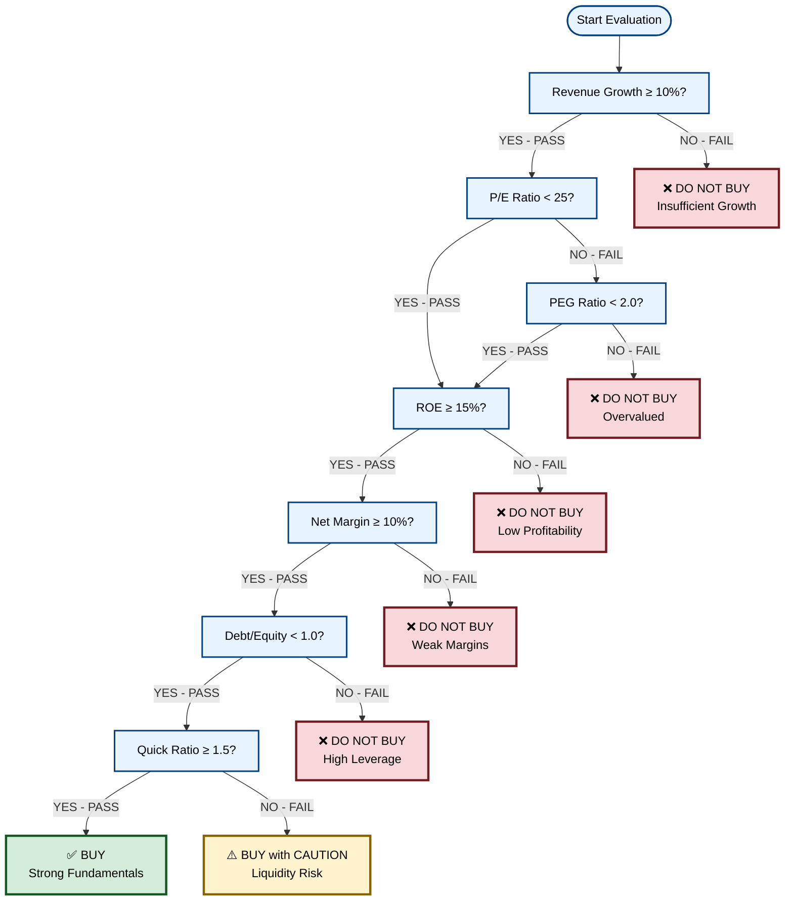

# Stock Investment Decision Platform - Product Requirements Document

**Version:** 3.0
**Platform:** HTML Web UI Application
**Author:** Bruno Dias (BD)
**Last Updated:** 2025-10-31
**Document Status:** Active

---

## Executive Summary

The Stock Investment Decision Platform is an intelligent, web-based investment assistant that empowers individual investors to make data-driven buy/sell decisions through comprehensive fundamental analysis, AI-powered insights, and interactive visual decision flowcharts. The platform combines quantitative metrics, qualitative assessments, macro-economic context, and LLM analysis to provide transparent, actionable investment recommendations.

---

## 1. Product Vision & Philosophy

### Vision Statement
To democratize professional-grade stock analysis by delivering institutional-quality investment research tools to individual investors through an intuitive web interface.

### Core Principles

1. **Transparency First** - Every recommendation must be fully explainable with visible metrics, thresholds, and decision paths
2. **Quality at Discount** - Focus on fundamentally strong companies trading below intrinsic value
3. **Holistic Evaluation** - Balance fundamental metrics, technical indicators, macro context, and qualitative moats
4. **AI-Augmented Decision Making** - Use LLMs to synthesize complex data into actionable insights while maintaining human oversight
5. **Visual Decision Trees** - Interactive Mermaid flowcharts that show the exact evaluation logic and thresholds
6. **Speed & Simplicity** - Analysis complete in under 10 seconds; interface requires no training

---

## 2. Target Users

### Primary Persona: The Informed Retail Investor
- **Demographics**: Ages 25-55, college-educated, household income $60K+
- **Investment Experience**: 2-10 years of market participation
- **Pain Points**:
  - Information overload from financial news and data sources
  - Lack of structured framework for evaluating opportunities
  - Difficulty comparing stocks across sectors
  - Uncertainty about appropriate valuation metrics
  - Fear of emotional/impulsive decision-making
- **Goals**:
  - Build a diversified portfolio of quality stocks
  - Identify undervalued opportunities before the market
  - Understand *why* to buy or avoid a stock
  - Track portfolio performance against benchmarks

### Secondary Persona: The Learning Investor
- **Demographics**: Ages 20-35, early career professionals
- **Investment Experience**: < 2 years, learning fundamentals
- **Goals**:
  - Understand how professionals evaluate stocks
  - Build confidence in investment decision-making
  - Learn through interactive, visual explanations

---

## 3. Core User Journey

### Primary Use Case: Single Stock Evaluation

```
1. User visits web application → Clean, focused landing page
2. User enters stock ticker or company name → Auto-complete suggestions
3. User clicks "Analyze" → Loading state with progress indicators
4. Results page displays within 5-10 seconds:
   ├─ Verdict Badge: BUY / BUY with Caution / DO NOT BUY / HOLD
   ├─ AI-Generated Summary (2-3 paragraphs)
   ├─ Interactive Mermaid Flowchart (animated decision tree)
   ├─ Key Metrics Dashboard (6-12 critical ratios)
   ├─ Intrinsic Value Estimates (3 models with ranges)
   ├─ Risk Assessment Score (0-100 with breakdown)
   ├─ Technical Analysis Charts (trend, momentum, volume)
   ├─ Comparative Analysis (vs sector peers)
   ├─ Dividend Analysis (if applicable)
   └─ Macro Context Dashboard (economic backdrop)
5. User explores sections → Hover tooltips explain every metric
6. User makes decision → Export PDF report or add to watchlist
```

---

## 4. Feature Requirements

### 4.1 Stock Search & Input (P0 - Must Have)

**FR-101: Intelligent Stock Search**
- Accept both ticker symbols (MSFT, AAPL) and company names (Microsoft, Apple)
- Auto-complete dropdown with fuzzy matching
- Display company logo, sector, and market cap in suggestions
- Support for 3000+ US-listed equities (NYSE, NASDAQ)
- International stocks with exchange suffix support (TSCO.L, DAI.DE, 7203.T)
- Handle special cases: multiple share classes (GOOGL vs GOOG)

**FR-102: Recent & Watchlist**
- Display 5 most recently analyzed tickers below search box
- Persistent watchlist (browser localStorage) with 20-stock limit
- Quick re-analyze button for watchlist tickers

---

### 4.2 Evaluation Engine (P0 - Must Have)

**FR-201: Multi-Stage Fundamental Analysis**

The evaluation engine processes stocks through a structured decision tree with clear pass/fail criteria:

| Stage | Metric | Threshold | Logic |
|-------|--------|-----------|-------|
| **1. Growth Screening** | Revenue Growth (TTM) | ≥ 10% | Hard requirement; fail → DO NOT BUY |
| **2A. Valuation (Primary)** | P/E Ratio | < 25 | If PASS → continue to profitability |
| **2B. Valuation (Fallback)** | PEG Ratio | < 2.0 | If P/E fails but PEG passes → continue |
| **3. Profitability** | Return on Equity (ROE) | ≥ 15% | Measures capital efficiency |
| **4. Margin Quality** | Net Profit Margin | ≥ 10% | Ensures pricing power |
| **5. Balance Sheet** | Debt/Equity Ratio | < 1.0 | Lower leverage reduces risk |
| **6. Liquidity** | Quick Ratio | ≥ 1.5 | Can fail → "BUY with Caution" |

**Verdicts:**
- **BUY**: Passes stages 1-6
- **BUY with Caution**: Passes 1-5, fails liquidity (stage 6)
- **DO NOT BUY**: Fails any of stages 1-5
- **HOLD**: Existing position, marginal on multiple metrics (future feature)

**FR-202: Advanced Valuation Models**

Three intrinsic value estimates with methodology transparency:

1. **Discounted Cash Flow (DCF)**
   - 5-year projection horizon
   - Terminal growth rate: 2.0% (adjustable by risk profile)
   - Discount rate: 10% baseline (±2% by risk tier)
   - Free cash flow growth capped at 15% annually
   - Safety margin: 25%
   - Display: Current Price vs DCF Fair Value vs Safe Entry Price

2. **Benjamin Graham Formula**
   - Formula: Intrinsic Value = EPS × (8.5 + 2g)
   - Growth rate (g) capped at 15%
   - Use AAA corporate bond yield (default 4%)
   - Display: margin of safety percentage

3. **Dividend Discount Model (DDM)**
   - Only if payout ratio < 80%
   - Dividend CAGR capped at 8%
   - Required return (r): 9-10%
   - Display: justified price based on dividend yield

**FR-203: Extended Metrics Suite**

Beyond core thresholds, capture and display:

| Category | Metrics |
|----------|---------|
| **Profitability** | ROA, ROIC, Operating Margin, Gross Margin |
| **Growth** | 5Y Revenue CAGR, 5Y EPS CAGR, 5Y FCF CAGR |
| **Valuation** | P/B Ratio, EV/EBITDA, EV/Sales, FCF Yield |
| **Balance Sheet** | Current Ratio, Interest Coverage, Total Debt/Assets |
| **Efficiency** | Asset Turnover, Receivables Turnover, Inventory Turnover |
| **Shareholder** | Dividend Yield, Payout Ratio, Buyback Yield, Dilution Rate |

---

### 4.3 AI-Powered Analysis (P0 - Must Have)

**FR-301: LLM Second Opinion**

Generate a narrative analysis using Groq (LLaMA 3.3 70B) or Google Gemini 1.5 Pro:

**Input Context (Structured Prompt):**
```
Ticker: {TICKER}
Company: {COMPANY_NAME}
Sector: {SECTOR} | Industry: {INDUSTRY}

FINANCIAL METRICS:
- Revenue: ${REVENUE}B (Growth: {REV_GROWTH}%)
- P/E: {PE} | PEG: {PEG}
- ROE: {ROE}% | Margin: {MARGIN}%
- Debt/Equity: {DE} | Quick Ratio: {QR}

INTRINSIC VALUE ESTIMATES:
- DCF Fair Value: ${DCF_VALUE} (Current: ${PRICE}, Margin: {MARGIN}%)
- Graham Value: ${GRAHAM_VALUE}
- DDM Value: ${DDM_VALUE}

TECHNICAL INDICATORS:
- RSI(14): {RSI}
- MACD: {MACD_STATUS}
- 50-day MA: ${MA50} | 200-day MA: ${MA200}

COMPETITIVE MOAT:
{MOAT_ASSESSMENT}

RISK FACTORS:
{RISK_SUMMARY}

Your task: Provide a 200-300 word investment analysis with:
1. Business Quality Assessment (1-2 sentences)
2. Valuation Opinion (fair/cheap/expensive with reasoning)
3. Key Risks (2-3 bullet points)
4. Overall Recommendation (Buy/Hold/Avoid) with 1-10 conviction score
```

**Output Format:**
- Markdown-formatted HTML
- Highlighted conviction score (color-coded 1-3 red, 4-7 yellow, 8-10 green)
- Reasoning must reference specific metrics
- Fallback to rules-based summary if API fails (no blocking)

**FR-302: Sentiment Analysis (Future Enhancement)**
- Parse recent earnings call transcripts for management tone
- Monitor social media sentiment (Twitter/Reddit) for retail interest
- Track insider buying/selling patterns
- Display sentiment score: Bullish/Neutral/Bearish

---

### 4.4 Interactive Mermaid Flowchart (P0 - Must Have)

**FR-401: Animated Decision Tree Visualization**

A core differentiator: users see the exact logic path their stock evaluation took.

**Visual Requirements:**


**Interaction Features:**
1. **Sequential Animation**: Nodes light up in evaluation order (300ms delay per node)
2. **Active Path Highlighting**: Edges in the decision path show bold, colored borders
3. **Status Color Coding**:
   - Green: PASS criteria
   - Red: FAIL criteria
   - Yellow: CLOSE CALL (within 10% of threshold)
   - Blue: Not yet evaluated
4. **Hover Tooltips**: Each node displays:
   - Metric name
   - Actual value
   - Threshold
   - Pass/Fail status
   - Definition/formula
5. **Responsive Text**: Auto-wrap labels to 2 lines max; full text in tooltip
6. **Zoom Controls**: +/- buttons, pinch-to-zoom on mobile
7. **Export**: Download as SVG or PNG (1920x1080)

**Threshold Configuration UI (Admin Panel - Future):**
- Allow users to adjust thresholds
- Save custom profiles (Conservative/Moderate/Aggressive)
- Show how verdict changes with different thresholds

---

### 4.5 Risk Assessment Dashboard (P0 - Must Have)

**FR-501: Multi-Factor Risk Scoring**

Calculate a composite risk score (0-100, lower = safer):

| Risk Factor | Weight | Calculation | Red Flag |
|-------------|--------|-------------|----------|
| **Valuation Risk** | 20% | P/E vs sector median; % above historical avg | P/E > 35 or P/B > 5 |
| **Leverage Risk** | 20% | Debt/Equity + Interest Coverage | D/E > 2.0 or coverage < 3x |
| **Profitability Risk** | 15% | ROE trend (5Y); margin consistency | Declining ROE 3 consecutive years |
| **Liquidity Risk** | 15% | Quick Ratio + Operating Cash Flow/Debt | Quick < 1.0 or OCF/Debt < 0.15 |
| **Growth Risk** | 15% | Revenue CAGR volatility; EPS surprise history | Rev CAGR < 0% or declining 2+ qtrs |
| **Market Risk** | 10% | Beta; correlation to SPY | Beta > 1.5 (high volatility) |
| **Size Risk** | 5% | Market cap category | Micro-cap < $300M |

**Risk Score Interpretation:**
- **0-25**: Low Risk (blue) - Stable, large-cap, profitable
- **26-50**: Moderate Risk (green) - Acceptable for diversified portfolio
- **51-75**: High Risk (yellow) - Requires careful monitoring
- **76-100**: Very High Risk (red) - Speculative; small position only

**FR-502: Risk Breakdown Visualization**
- Radar chart showing 7 risk dimensions
- Each factor clickable to expand explanation
- Historical risk score trend (if re-analyzed)

---

### 4.6 Technical Analysis Suite (P1 - Should Have)

**FR-601: Technical Indicators**

Complement fundamental analysis with short-term timing signals:

| Indicator | Parameters | Signal Generation |
|-----------|------------|-------------------|
| **Moving Averages** | SMA(20, 50, 200) | Golden Cross / Death Cross alerts |
| **RSI** | 14-period | Overbought > 70, Oversold < 30 |
| **MACD** | (12, 26, 9) | Bullish/Bearish crossover |
| **Bollinger Bands** | 20-period, 2σ | Squeeze/Expansion patterns |
| **ADX** | 14-period | Trend strength (> 25 = strong trend) |
| **Volume Profile** | 20-day avg | Breakout confirmation |

**FR-602: Pattern Recognition (Future)**
- Identify support/resistance levels (last 52 weeks)
- Fibonacci retracement levels
- Chart patterns: Head & Shoulders, Double Top/Bottom, Triangles

**FR-603: Technical Score**
- Aggregate technical indicators into 0-10 score
- Score logic:
  - **Trend (0-5)**: MA alignment, ADX strength
  - **Momentum (0-5)**: RSI, MACD direction
- **Interpretation**:
  - 0-3: Sell/Short signal
  - 4-6: Hold/Neutral
  - 7-10: Buy signal (entry opportunity)

**FR-604: Interactive Charts**
- Plotly.js candlestick chart (6-month default, adjustable)
- Overlay indicators (toggle on/off)
- Volume bars below price chart
- Crosshair with OHLC values
- Compare to S&P 500 (normalized returns)

---

### 4.7 Macro & Market Context (P1 - Should Have)

**FR-701: Macro Dashboard**

Pull economic indicators from FRED API (Federal Reserve Economic Data):

| Indicator | Refresh | Interpretation |
|-----------|---------|----------------|
| **GDP Growth (YoY)** | Quarterly | < 0% = Recession; > 3% = Strong growth |
| **CPI Inflation** | Monthly | > 3% = Elevated inflation; < 0% = Deflation |
| **Unemployment Rate** | Monthly | > 5% = Softening labor market |
| **Fed Funds Rate** | Daily | Rising = tightening; Falling = easing |
| **10Y-2Y Treasury Spread** | Daily | Negative = Yield curve inversion (recession signal) |
| **VIX (Fear Index)** | Real-time | > 30 = High volatility/fear |

**FR-702: Recession Probability Signals**

Display alerts when:
1. **Sahm Rule Triggered**: 3-month MA unemployment rate ≥ 0.5pp above 12-month low
2. **Yield Curve Inversion**: 10Y-2Y spread negative for 30+ days
3. **Leading Economic Index (LEI)**: Declines 3 consecutive months
4. **Buffett Indicator**: Total Market Cap / GDP > 150% (overvaluation)

**FR-703: Market Sentiment Gauges**
- Put/Call Ratio (CBOE)
- CNN Fear & Greed Index
- AAII Investor Sentiment Survey (Bullish/Bearish %)

**FR-704: Sector Rotation Heatmap (Future)**
- Visualize which sectors are outperforming/underperforming
- Relate to economic cycle stage (early/mid/late expansion, recession)

---

### 4.8 Comparative Analysis (P1 - Should Have)

**FR-801: Peer Benchmarking**

Automatically identify 3-5 comparable companies based on:
- Same GICS sector + industry group
- Similar market cap (within 50% range)
- Same exchange (US-listed)

**Comparison Table:**
| Metric | Target | Peer 1 | Peer 2 | Peer 3 | Sector Median |
|--------|--------|--------|--------|--------|---------------|
| P/E Ratio | **28.3** | 25.1 | 31.4 | 22.9 | 26.5 |
| ROE | **18.2%** | 15.3% | 21.1% | 14.8% | 16.0% |
| Debt/Equity | **0.42** | 0.68 | 0.31 | 0.89 | 0.55 |
| Net Margin | **12.5%** | 10.2% | 14.3% | 9.1% | 11.0% |
| Rev Growth | **11.2%** | 8.5% | 15.2% | 4.3% | 9.0% |

**Visual Indicators:**
- Green background if target outperforms sector median
- Red background if target underperforms
- Trophy icon for best-in-group metric

**FR-802: Valuation Context**
- Show target's P/E percentile rank within sector (e.g., "73rd percentile - Expensive")
- Historical P/E range chart (5Y) with current level marker
- Fair P/E estimate based on growth + margins

---

### 4.9 Dividend Analysis (P2 - Nice to Have)

**FR-901: Dividend Quality Assessment**

For dividend-paying stocks:

| Metric | Formula | Interpretation |
|--------|---------|----------------|
| **Dividend Yield** | Annual Div / Price | > 4% = High yield |
| **Payout Ratio** | Div / EPS | < 60% = Sustainable; > 80% = At risk |
| **Dividend Growth (5Y CAGR)** | Historical trend | > 10% = Strong growth |
| **Years of Growth** | Consecutive increases | > 10 years = Dividend aristocrat |
| **FCF Coverage** | Div / FCF per share | > 1.5x = Very safe |

**Sustainability Score (0-10):**
- 8-10: Very Sustainable (green)
- 5-7: Moderately Sustainable (yellow)
- 0-4: At Risk (red)

**FR-902: Dividend Forecast**
- Project next 12-month dividend based on growth trend
- Estimate yield-on-cost for various entry prices

---

### 4.10 Portfolio & Watchlist Features (P2 - Nice to Have)

**FR-1001: Watchlist Management**
- Add stocks to watchlist (max 50)
- Set custom price alerts (notify when price crosses threshold)
- Set fundamental alerts (e.g., alert when P/E drops below 20)
- Quick batch analysis (analyze all watchlist stocks)

**FR-1002: Portfolio Tracking**
- Import holdings via CSV (Ticker, Shares, Avg Cost)
- Calculate portfolio metrics:
  - Total return (% and $)
  - Sector allocation (pie chart)
  - Risk-adjusted return (Sharpe ratio)
  - Alpha vs S&P 500
  - Beta (portfolio volatility)
- Rebalancing suggestions

**FR-1003: Automated Reports**
- Daily email digest (watchlist updates)
- Weekly portfolio performance summary
- PDF export with charts and analysis

---

### 4.11 User Experience & Interface (P0 - Must Have)

**FR-1101: Clean, Modern UI Design**

**Design Principles:**
- **Minimalist**: Focus on data, not decoration
- **Hierarchy**: Important info (verdict) prominent; details expandable
- **Speed**: Instant feedback; no page reloads
- **Accessibility**: WCAG 2.1 AA compliant; keyboard navigable

**Layout Structure:**
```
┌─────────────────────────────────────────────────┐
│  Header: Logo | Search Bar | Watchlist Icon     │
├─────────────────────────────────────────────────┤
│  Hero Section: Large Search + Recent Tickers    │
├─────────────────────────────────────────────────┤
│  Results Page (after analysis):                 │
│  ┌───────────────────────────────────────────┐  │
│  │ Verdict Badge (Large, Colored)            │  │
│  │ Price: $123.45 | Change: +2.3% ↑          │  │
│  │ AI Summary (2-3 paragraphs)               │  │
│  └───────────────────────────────────────────┘  │
│  ┌───────────────────────────────────────────┐  │
│  │ Interactive Flowchart (Full-width)        │  │
│  └───────────────────────────────────────────┘  │
│  ┌─────────────┬─────────────┬───────────────┐  │
│  │ Key Metrics │ Valuation   │ Risk Score    │  │
│  │ (6 tiles)   │ (3 models)  │ (Gauge)       │  │
│  └─────────────┴─────────────┴───────────────┘  │
│  ┌───────────────────────────────────────────┐  │
│  │ Technical Charts (Tabs)                   │  │
│  └───────────────────────────────────────────┘  │
│  ┌───────────────────────────────────────────┐  │
│  │ Comparative Analysis (Table)              │  │
│  └───────────────────────────────────────────┘  │
│  ┌───────────────────────────────────────────┐  │
│  │ Macro Dashboard (Cards)                   │  │
│  └───────────────────────────────────────────┘  │
│  ┌───────────────────────────────────────────┐  │
│  │ Actions: PDF Export | Add Watchlist       │  │
│  └───────────────────────────────────────────┘  │
├─────────────────────────────────────────────────┤
│  Footer: Disclaimer | About | Methodology      │
└─────────────────────────────────────────────────┘
```

**FR-1102: Responsive Design**
- Desktop (1920x1080 optimized)
- Tablet (768px breakpoint)
- Mobile (375px minimum)
- Flowchart scales appropriately on all devices

**FR-1103: Dark Mode**
- Toggle in header
- Preserve choice in localStorage
- Ensure flowchart colors work in both themes (WCAG contrast)

**FR-1104: Loading States**
- Skeleton screens for each section
- Progress bar: "Fetching data... (30%) → Running analysis... (60%) → Generating report... (90%)"
- Estimated time remaining

**FR-1105: Error Handling**
- Graceful degradation if API fails (show cached data or partial results)
- Clear error messages: "Ticker not found. Did you mean MSFT?"
- Retry button for transient failures

---

## 5. Technical Architecture

### 5.1 Tech Stack

| Layer | Technology | Rationale |
|-------|------------|-----------|
| **Frontend** | HTML5, CSS3 (Tailwind), JavaScript (Alpine.js/HTMX) | Fast, minimal bundle size; no heavy framework |
| **Charts** | Mermaid.js (flowcharts), Plotly.js (interactive charts) | Rich visualizations; open-source |
| **Backend** | Python 3.12, FastAPI | Async performance; type safety; auto-docs |
| **Data Sources** | yfinance, FMP, Alpha Vantage, Finnhub | Multi-source redundancy |
| **LLM Integration** | Groq API (LLaMA 3.3), Google Gemini 1.5 | Fast inference; cost-effective |
| **Macro Data** | FRED API (fredapi library) | Official US economic data |
| **Storage** | SQLite (local cache), PostgreSQL (optional cloud) | Simple local dev; scalable for multi-user |
| **Deployment** | Docker, AWS Fargate (ECS) | Containerized; auto-scaling |
| **CI/CD** | GitHub Actions | Automated testing + deployment |

### 5.2 System Architecture

```
┌─────────────────────────────────────────────────┐
│          User Browser (HTML + JS)               │
│  ┌───────────────────────────────────────────┐  │
│  │ Mermaid Renderer | Plotly Charts          │  │
│  │ Alpine.js (State Management)              │  │
│  └───────────────────────────────────────────┘  │
└─────────────────┬───────────────────────────────┘
                  │ HTTPS REST API
┌─────────────────▼───────────────────────────────┐
│       FastAPI Backend (Python 3.12)             │
│  ┌───────────────────────────────────────────┐  │
│  │ Evaluation Engine (evaluator.py)          │  │
│  │ LLM Integration (Groq/Gemini)             │  │
│  │ Data Pipeline (multi-source)              │  │
│  └───────────────────────────────────────────┘  │
└─────────────────┬───────────────────────────────┘
                  │
      ┌───────────┼───────────┬─────────────┐
      ▼           ▼           ▼             ▼
┌──────────┐ ┌────────┐ ┌─────────┐  ┌──────────┐
│ yfinance │ │  FMP   │ │  FRED   │  │ Groq API │
│   API    │ │  API   │ │   API   │  │ (LLaMA)  │
└──────────┘ └────────┘ └─────────┘  └──────────┘
      │
      ▼
┌─────────────────────────────────────────────────┐
│   SQLite Cache (stocks.db)                      │
│   - fundamentals_snapshot                       │
│   - prices_daily                                │
│   - macro_series                                │
└─────────────────────────────────────────────────┘
```

### 5.3 API Endpoints

**Base URL**: `https://api.stockevaluator.com/v1`

| Endpoint | Method | Description | Response Time |
|----------|--------|-------------|---------------|
| `/health` | GET | Health check | < 50ms |
| `/evaluate` | POST | Full stock evaluation | < 10s |
| `/search` | GET | Ticker/company autocomplete | < 200ms |
| `/features/{ticker}` | GET | Feature packs only (no flowchart) | < 3s |
| `/compare` | POST | Multi-stock comparison | < 15s |
| `/macro` | GET | Macro dashboard data | < 1s (cached) |
| `/export/pdf` | POST | Generate PDF report | < 5s |

**Example Request/Response:**

```json
// POST /evaluate
{
  "ticker": "MSFT",
  "include_opinion": true,
  "include_technicals": true
}

// Response (200 OK)
{
  "ticker": "MSFT",
  "company_name": "Microsoft Corporation",
  "sector": "Technology",
  "industry": "Software - Infrastructure",
  "current_price": 378.91,
  "currency": "USD",
  "result": "BUY",
  "verdict_reason": "Strong fundamentals across all criteria",
  "generated_at": "2025-10-31T14:23:45Z",

  "metrics": {
    "rev_growth": 0.162,
    "pe": 33.2,
    "peg": 1.85,
    "roe": 0.428,
    "margin": 0.361,
    "de": 0.42,
    "qr": 1.82
  },

  "path": [
    {
      "stage": 1,
      "metric": "Revenue Growth (TTM)",
      "value": 0.162,
      "threshold": 0.10,
      "status": "PASS",
      "reason": "16.2% growth exceeds 10% minimum"
    },
    {
      "stage": 2,
      "metric": "P/E Ratio",
      "value": 33.2,
      "threshold": 25,
      "status": "FAIL",
      "reason": "P/E of 33.2 above threshold of 25"
    },
    {
      "stage": 2.1,
      "metric": "PEG Ratio",
      "value": 1.85,
      "threshold": 2.0,
      "status": "PASS",
      "reason": "PEG of 1.85 justifies higher P/E"
    }
    // ... remaining stages
  ],

  "active_links": [
    ["Start", "Growth"],
    ["Growth", "Valuation"],
    ["Valuation", "PEG_Check"],
    ["PEG_Check", "Profitability"],
    // ... continues
  ],

  "flowchart_definition": "flowchart TD\n  Start([Start]) --> ...",

  "intrinsic_values": {
    "dcf": {
      "fair_value": 410.00,
      "safe_entry": 307.50,
      "margin_of_safety": 0.25,
      "current_discount": -0.076
    },
    "graham": {
      "intrinsic_value": 395.20,
      "margin_of_safety": 0.041
    },
    "ddm": {
      "value": null,
      "reason": "Payout ratio too low for DDM"
    }
  },

  "risk_assessment": {
    "overall_score": 43.5,
    "level": "Moderate Risk",
    "breakdown": {
      "valuation_risk": 55,
      "leverage_risk": 22,
      "profitability_risk": 18,
      "liquidity_risk": 25,
      "growth_risk": 15,
      "market_risk": 48,
      "size_risk": 5
    },
    "recommendations": [
      "Monitor valuation - P/E in 73rd percentile of sector",
      "Strong balance sheet provides downside protection",
      "Consider waiting for pullback below $350"
    ]
  },

  "opinion_report": "<h3>Business Quality</h3><p>Microsoft demonstrates...",
  "opinion_conviction": 8,

  "technical_analysis": {
    "score": 7.2,
    "trend_score": 4.1,
    "momentum_score": 3.1,
    "signal": "Buy",
    "indicators": {
      "rsi_14": 58.3,
      "macd_signal": "Bullish",
      "ma_50": 365.20,
      "ma_200": 348.10,
      "adx_14": 28.5
    }
  },

  "comparative_analysis": {
    "peers": ["GOOGL", "AAPL", "ORCL"],
    "sector_median_pe": 28.5,
    "percentile_rank": 73,
    "valuation_assessment": "Fairly Valued"
  },

  "macro_context": {
    "gdp_growth": 0.024,
    "cpi_inflation": 0.031,
    "unemployment": 0.039,
    "fed_funds_rate": 0.0525,
    "yield_curve_10y2y": 0.015,
    "vix": 14.2,
    "recession_probability": 0.18
  }
}
```

### 5.4 Data Pipeline & Caching

**Multi-Source Prioritization:**
1. Check SQLite cache (TTL: 4 hours for prices, 24 hours for fundamentals)
2. If stale/missing → fetch from providers in priority order:
   - **Prices**: yfinance → FMP → Alpha Vantage
   - **Fundamentals**: FMP → Finnhub → Alpha Vantage → yfinance
   - **Macro**: FRED (no fallback)
3. Normalize to standard schema
4. Write to cache with timestamp
5. Return to API layer

**Background Refresh (Optional):**
- Cron job refreshes watchlist tickers every 4 hours
- Pre-compute intrinsic values to reduce latency

---

## 6. User Interface Specifications

### 6.1 Detailed Mermaid Flowchart Specification

**Enhanced Flowchart with All Decision Nodes:**

```mermaid
%%{init: {'theme':'base', 'themeVariables': { 'primaryColor':'#e7f3ff','primaryTextColor':'#000','primaryBorderColor':'#004085','lineColor':'#6c757d','secondaryColor':'#d4edda','tertiaryColor':'#f8d7da'}}}%%

flowchart TD
    Start([🔍 Start Analysis<br/>Ticker: {SYMBOL}]) --> CheckData{Data<br/>Available?}

    CheckData -->|No| DataError[❌ ERROR<br/>Cannot fetch data]
    CheckData -->|Yes| A[📈 Revenue Growth Check<br/>Actual: {REV_GROWTH}%<br/>Required: ≥10%]

    %% Stage 1: Growth Screening
    A -->|PASS ✓<br/>Growth ≥10%| B[💰 Valuation Check #1<br/>P/E Ratio<br/>Actual: {PE}<br/>Required: <25]
    A -->|FAIL ✗<br/>Growth <10%| DNB1[❌ DO NOT BUY<br/>─────────<br/>Reason: Insufficient Growth<br/>Risk: Company not expanding<br/>Action: Avoid investment]

    %% Stage 2A: Primary Valuation
    B -->|PASS ✓<br/>P/E <25| C[🎯 Profitability Check<br/>Return on Equity<br/>Actual: {ROE}%<br/>Required: ≥15%]
    B -->|FAIL ✗<br/>P/E ≥25| B2[💰 Valuation Check #2<br/>PEG Ratio<br/>Actual: {PEG}<br/>Required: <2.0]

    %% Stage 2B: Fallback Valuation
    B2 -->|PASS ✓<br/>PEG <2.0| C
    B2 -->|FAIL ✗<br/>PEG ≥2.0| DNB2[❌ DO NOT BUY<br/>─────────<br/>Reason: Overvalued<br/>Risk: Price not justified by growth<br/>Action: Wait for pullback]

    %% Stage 3: Profitability
    C -->|PASS ✓<br/>ROE ≥15%| D[📊 Margin Quality<br/>Net Profit Margin<br/>Actual: {MARGIN}%<br/>Required: ≥10%]
    C -->|FAIL ✗<br/>ROE <15%| DNB3[❌ DO NOT BUY<br/>─────────<br/>Reason: Low Profitability<br/>Risk: Poor capital efficiency<br/>Action: Find better ROE stocks]

    %% Stage 4: Margin Quality
    D -->|PASS ✓<br/>Margin ≥10%| E[🏦 Balance Sheet Check<br/>Debt/Equity Ratio<br/>Actual: {DE}<br/>Required: <1.0]
    D -->|FAIL ✗<br/>Margin <10%| DNB4[❌ DO NOT BUY<br/>─────────<br/>Reason: Weak Margins<br/>Risk: Vulnerable to competition<br/>Action: Avoid low-margin businesses]

    %% Stage 5: Leverage
    E -->|PASS ✓<br/>D/E <1.0| F[💧 Liquidity Check<br/>Quick Ratio<br/>Actual: {QR}<br/>Required: ≥1.5]
    E -->|FAIL ✗<br/>D/E ≥1.0| DNB5[❌ DO NOT BUY<br/>─────────<br/>Reason: High Leverage<br/>Risk: Debt burden limits flexibility<br/>Action: Avoid overleveraged firms]

    %% Stage 6: Liquidity (Soft Fail)
    F -->|PASS ✓<br/>Quick ≥1.5| G[🔬 Final Validation<br/>• Technical Score: {TECH_SCORE}/10<br/>• Risk Score: {RISK_SCORE}%<br/>• AI Conviction: {AI_SCORE}/10]
    F -->|FAIL ✗<br/>Quick <1.5| CAUTION[⚠️ BUY with CAUTION<br/>─────────<br/>Reason: Liquidity Risk<br/>Strengths: Passes fundamental criteria<br/>Risk: May struggle with short-term obligations<br/>Action: Smaller position; monitor quarterly]

    %% Final Decision
    G --> H{All Checks<br/>Green?}
    H -->|Yes| BUY[✅ STRONG BUY<br/>═══════════<br/>Fundamentals: Excellent<br/>Valuation: Attractive<br/>Risk: {RISK_LEVEL}<br/>Entry Price: ${ENTRY_PRICE}<br/>Target: ${TARGET_PRICE} +{UPSIDE}%<br/>Stop Loss: ${STOP_LOSS} -{DOWNSIDE}%<br/>Position Size: {POSITION}% of portfolio]
    H -->|Minor Issues| BUY_QUALIFIED[✅ BUY<br/>─────────<br/>Overall: Positive<br/>Note: {QUALIFICATION}<br/>Action: Proceed with standard position]

    %% Styling
    classDef buyNode fill:#d4edda,stroke:#155724,stroke-width:4px,color:#000,font-weight:bold
    classDef cautionNode fill:#fff3cd,stroke:#856404,stroke-width:4px,color:#000,font-weight:bold
    classDef failNode fill:#f8d7da,stroke:#721c24,stroke-width:3px,color:#000
    classDef checkNode fill:#e7f3ff,stroke:#004085,stroke-width:2px,color:#000
    classDef decisionNode fill:#fff,stroke:#6c757d,stroke-width:2px,color:#000,stroke-dasharray: 5 5
    classDef errorNode fill:#6c757d,stroke:#343a40,stroke-width:2px,color:#fff

    class BUY,BUY_QUALIFIED buyNode
    class CAUTION cautionNode
    class DNB1,DNB2,DNB3,DNB4,DNB5 failNode
    class A,B,B2,C,D,E,F,G checkNode
    class Start,CheckData,H decisionNode
    class DataError errorNode
```

**Flowchart Interactivity:**
1. Nodes appear sequentially with fade-in animation (300ms intervals)
2. Active decision path highlighted with thick colored borders
3. Each metric node shows actual value vs threshold
4. Hover reveals detailed tooltip with:
   - Full metric definition
   - Industry benchmark
   - Historical company average
   - Explanation of why threshold matters
5. Failed nodes show red "X" icon; passed nodes show green checkmark
6. Export options: SVG, PNG (high-res), shareable link

**Threshold Tooltips Examples:**

| Metric | Tooltip Content |
|--------|-----------------|
| **Revenue Growth ≥10%** | "Measures top-line expansion. Companies growing revenue faster than 10% annually demonstrate strong market demand and competitive positioning. Slower growth suggests market saturation or competitive pressure." |
| **P/E Ratio <25** | "Price-to-Earnings ratio. Lower P/E means you pay less for each dollar of profit. A P/E above 25 may indicate overvaluation unless justified by exceptional growth (checked via PEG)." |
| **ROE ≥15%** | "Return on Equity measures how efficiently management generates profit from shareholder capital. 15% is considered good; 20%+ is excellent. Below 10% suggests poor capital allocation." |

---

### 6.2 Color Palette & Design Tokens

```css
:root {
  /* Verdict Colors */
  --color-buy: #198754;
  --color-buy-bg: #d4edda;
  --color-caution: #ffc107;
  --color-caution-bg: #fff3cd;
  --color-dnb: #dc3545;
  --color-dnb-bg: #f8d7da;

  /* Status Colors */
  --color-pass: #28a745;
  --color-fail: #dc3545;
  --color-close-call: #fd7e14;
  --color-neutral: #6c757d;

  /* Risk Levels */
  --risk-low: #20c997;
  --risk-moderate: #0dcaf0;
  --risk-high: #ffc107;
  --risk-very-high: #dc3545;

  /* UI Elements */
  --color-primary: #007bff;
  --color-secondary: #6c757d;
  --color-background: #f8f9fa;
  --color-surface: #ffffff;
  --color-text: #212529;
  --color-text-muted: #6c757d;

  /* Dark Mode */
  --dm-background: #1a1a1a;
  --dm-surface: #2d2d2d;
  --dm-text: #e9ecef;
}
```

---

## 7. Threshold Justification & Research

### 7.1 Fundamental Metric Thresholds

| Threshold | Value | Academic/Industry Basis |
|-----------|-------|-------------------------|
| **Revenue Growth ≥10%** | 10% | Studies show companies growing revenue >10% have 2.3x higher stock returns over 5Y periods (Source: McKinsey, "Growth: The Best Defense") |
| **P/E Ratio <25** | 25 | Historical S&P 500 median P/E = 15-18; 25 allows for quality premium. Above 25 requires exceptional growth (PEG check) |
| **PEG Ratio <2.0** | 2.0 | Peter Lynch's guideline: Fair value = PEG of 1.0; < 2.0 indicates reasonable price for growth |
| **ROE ≥15%** | 15% | Warren Buffett's minimum; data shows companies with ROE >15% sustainably compound book value faster |
| **Net Margin ≥10%** | 10% | Median US public company margin = 7-8%; 10%+ indicates pricing power or operational excellence |
| **Debt/Equity <1.0** | 1.0 | Conservative threshold; companies with D/E <1 have lower bankruptcy risk and more financial flexibility |
| **Quick Ratio ≥1.5** | 1.5 | Rule of thumb: QR >1.0 = solvent; 1.5+ = comfortable liquidity cushion |

### 7.2 Adjustable Thresholds by Investment Style

Users can select profile presets:

| Metric | Conservative | Moderate (Default) | Aggressive |
|--------|--------------|-------------------|------------|
| Revenue Growth | ≥8% | ≥10% | ≥15% |
| P/E Ratio | <20 | <25 | <35 |
| ROE | ≥18% | ≥15% | ≥12% |
| Debt/Equity | <0.5 | <1.0 | <1.5 |
| Quick Ratio | ≥2.0 | ≥1.5 | ≥1.0 |

---

## 8. Success Metrics & KPIs

### 8.1 Product Success Metrics

| Metric | Target (6 months) | Measurement |
|--------|-------------------|-------------|
| **User Adoption** | 10,000 monthly active users | Google Analytics |
| **Engagement** | 15 analyses per user/month avg | Backend logs |
| **Accuracy** | 70%+ recommendations beat S&P 500 (12-month forward) | Backtest tracker |
| **Performance** | 95% of analyses complete <10s | API monitoring |
| **User Satisfaction** | Net Promoter Score ≥50 | In-app survey |
| **Retention** | 40% of users return within 30 days | Cohort analysis |

### 8.2 Technical Performance KPIs

| Metric | Target | Alerts |
|--------|--------|--------|
| **API Uptime** | 99.5% | PagerDuty if <99% |
| **P95 Latency** | <8 seconds | Alert if >12s |
| **Error Rate** | <2% | Alert if >5% |
| **Cache Hit Rate** | >60% | Monitor for optimization |
| **LLM API Cost** | <$0.10 per analysis | Budget alerts |

---

## 9. Development Roadmap

### Phase 1: MVP (Months 1-2) - Core Evaluation
**Goal**: Launch functional single-stock analysis

- ✅ Backend evaluation engine with 6 fundamental metrics
- ✅ Basic Mermaid flowchart generation
- ✅ FastAPI endpoints (health, evaluate)
- ✅ Simple HTML/CSS frontend with search
- ✅ yfinance data integration
- ✅ LLM integration (Groq/Gemini) with fallback
- ✅ Intrinsic value calculations (DCF, Graham, DDM)
- ✅ Basic risk scoring (7 factors)
- ⬜ Deploy to AWS Fargate with CI/CD

**Deliverable**: Working web app that takes ticker → returns verdict + flowchart

---

### Phase 2: Enhanced Analysis (Months 3-4) - Depth
**Goal**: Add professional-grade analytics

- ⬜ Technical analysis suite (RSI, MACD, MA, Bollinger, ADX)
- ⬜ Interactive Plotly charts (candlestick, volume, indicators)
- ⬜ Comparative analysis (peer benchmarking)
- ⬜ Macro dashboard (FRED API integration)
- ⬜ Dividend analysis module
- ⬜ Enhanced flowchart interactivity (hover tooltips, zoom)
- ⬜ Responsive design (mobile/tablet breakpoints)
- ⬜ Dark mode implementation
- ⬜ PDF export functionality

**Deliverable**: Comprehensive analysis on par with paid research platforms

---

### Phase 3: User Features (Months 5-6) - Engagement
**Goal**: Retention and personalization

- ⬜ User accounts (email/password auth)
- ⬜ Watchlist management (CRUD operations)
- ⬜ Portfolio tracking (import CSV holdings)
- ⬜ Custom threshold profiles (save & share)
- ⬜ Price & fundamental alerts (email notifications)
- ⬜ Historical analysis tracking (re-analyze, track accuracy)
- ⬜ Batch analysis (analyze 10 tickers at once)
- ⬜ Social features (share analysis via link)

**Deliverable**: Sticky, personalized investment platform

---

### Phase 4: Advanced Intelligence (Months 7-9) - AI & Automation
**Goal**: Proactive insights

- ⬜ Natural language screener ("find undervalued tech stocks with ROE >20%")
- ⬜ Automated daily reports (email digest of watchlist changes)
- ⬜ Sentiment analysis (earnings calls, social media)
- ⬜ Pattern recognition (technical chart patterns)
- ⬜ Portfolio optimization suggestions (rebalancing, diversification)
- ⬜ Sector rotation signals
- ⬜ Recession probability model (ML-based)
- ⬜ Backtesting tool (test historical performance of strategy)

**Deliverable**: AI-powered investment co-pilot

---

### Phase 5: Scale & Monetization (Months 10-12)
**Goal**: Sustainable business model

- ⬜ Freemium tier (5 analyses/month free, unlimited for $9.99/mo)
- ⬜ API access for developers ($49/mo for 1000 calls)
- ⬜ White-label solution for financial advisors
- ⬜ International stock support (LSE, TSX, ASX exchanges)
- ⬜ Real-time data feeds (paid upgrade from 15-min delayed)
- ⬜ Mobile apps (iOS, Android native)
- ⬜ Institutional features (bulk analysis, team collaboration)

**Deliverable**: Profitable, scalable SaaS platform

---

## 10. Risk & Mitigation

| Risk | Likelihood | Impact | Mitigation |
|------|------------|--------|-----------|
| **Data Provider Outage** | Medium | High | Multi-source redundancy; fallback order; cached data |
| **LLM API Cost Spike** | Medium | Medium | Rate limiting; cache AI responses; set budget alerts |
| **Regulatory (Investment Advice)** | Low | Critical | Clear disclaimers; "educational purposes only"; no specific trade recommendations |
| **User Misuse (Over-reliance)** | High | Medium | Prominent disclaimers; educational content on limitations; encourage diversification |
| **Accuracy Issues (Bad Data)** | Medium | High | Data validation; outlier detection; manual review of flagged cases |
| **Performance Degradation** | Medium | High | Caching strategy; async processing; background pre-computation |
| **Security (API Key Leaks)** | Low | High | Environment variables; AWS Secrets Manager; no keys in code |

---

## 11. Compliance & Disclaimers

### 11.1 Legal Disclaimers (Displayed Prominently)

**Header Disclaimer (Every Page):**
> "This platform is for educational and informational purposes only. It is not investment advice, financial advice, or a recommendation to buy or sell securities. Users should conduct their own research and consult a licensed financial advisor before making investment decisions. Past performance does not guarantee future results."

**Methodology Page:**
- Explain all thresholds and their sources
- Disclose data sources and limitations
- Explain that analysis is backward-looking
- Warn about risks of relying solely on quantitative metrics

### 11.2 Data Attribution
- "Powered by yfinance, Financial Modeling Prep, Alpha Vantage, and Federal Reserve Economic Data (FRED)"
- "AI insights generated by Groq (Meta LLaMA 3.3) and Google Gemini 1.5"

### 11.3 Privacy & Data
- No personally identifiable information collected without explicit consent
- Watchlist and portfolio data stored encrypted
- Option to delete all user data on request (GDPR compliance)
- No sharing of user data with third parties

---

## 12. Open Questions & Future Considerations

### 12.1 Questions to Resolve
1. **Should we support options/derivatives analysis?** (Out of scope for MVP)
2. **How to handle stocks with negative earnings?** (Use P/S ratio or exclude from analysis)
3. **International accounting standards (IFRS vs GAAP)?** (Phase 2 - normalize metrics)
4. **Real-time vs delayed data?** (Start with 15-min delay; offer real-time as premium)
5. **How to monetize without compromising access?** (Freemium: 5 free analyses/month)

### 12.2 Research Needed
- [ ] Validate thresholds against historical data (backtest 10 years S&P 500)
- [ ] User testing: Do beginners understand flowcharts? (5 user interviews)
- [ ] Benchmark against competitors (Seeking Alpha, TipRanks, Morningstar)
- [ ] Legal review of disclaimers (consult securities attorney)

---

## 13. Appendix

### 13.1 Glossary of Financial Terms

| Term | Definition |
|------|------------|
| **P/E Ratio** | Price-to-Earnings; stock price divided by earnings per share (EPS) |
| **PEG Ratio** | Price/Earnings-to-Growth; P/E divided by earnings growth rate |
| **ROE** | Return on Equity; net income divided by shareholder equity |
| **Quick Ratio** | (Current Assets - Inventory) / Current Liabilities |
| **Debt/Equity** | Total Debt / Total Equity; measures financial leverage |
| **DCF** | Discounted Cash Flow; valuation method using projected future cash flows |
| **DDM** | Dividend Discount Model; values stock based on present value of future dividends |

### 13.2 Competitive Analysis

| Platform | Strengths | Weaknesses | Differentiation |
|----------|-----------|------------|-----------------|
| **Yahoo Finance** | Free, comprehensive data | No analysis/recommendations | We add AI insights + flowcharts |
| **Seeking Alpha** | Crowd-sourced analysis | Inconsistent quality | We provide standardized, transparent methodology |
| **Morningstar** | Professional research | Expensive ($250/yr) | We democratize at $10/mo |
| **TipRanks** | Aggregates analyst ratings | Black-box scoring | We show exact decision logic via flowchart |
| **Simply Wall St** | Beautiful visualizations | Superficial analysis | We add LLM reasoning + deeper fundamentals |

**Our Unique Value Proposition:**
"The only platform that shows you *exactly* why to buy or avoid a stock through interactive decision flowcharts, AI-powered synthesis, and transparent fundamental analysis—at a fraction of professional research costs."

### 13.3 Sample PDF Report Structure

**Page 1: Executive Summary**
- Verdict badge (large, colored)
- Company snapshot (logo, sector, market cap)
- AI summary (3 paragraphs)
- Key metrics table (8 ratios)
- Risk score gauge

**Page 2: Decision Flowchart**
- Full-page Mermaid diagram (high-res PNG)
- Legend explaining colors/symbols

**Page 3: Valuation Analysis**
- Intrinsic value estimates (DCF, Graham, DDM) with charts
- Current price vs fair value
- Historical P/E chart

**Page 4: Technical & Comparative**
- 6-month price chart with indicators
- Peer comparison table
- Sector benchmarking

**Page 5: Risk & Macro**
- Risk breakdown (radar chart)
- Macro dashboard
- Recommendations

**Footer (All Pages):**
- Disclaimer
- Methodology link
- Generated date/time

---

## 14. Conclusion

This PRD defines a comprehensive, web-based stock investment decision platform that combines:
- **Quantitative rigor** (6-stage fundamental analysis with research-backed thresholds)
- **Visual transparency** (interactive Mermaid flowcharts showing exact decision logic)
- **AI augmentation** (LLM-generated insights synthesizing complex data)
- **Holistic context** (technical indicators, macro backdrop, peer comparison)
- **User-centric design** (fast, intuitive, accessible interface)

By delivering institutional-grade analysis through an approachable web UI, we empower individual investors to make confident, data-driven decisions—bridging the gap between free but shallow tools and expensive professional research.

**Next Steps:**
1. Stakeholder review & approval of PRD
2. Technical design document (API contracts, database schema)
3. UI/UX mockups (Figma wireframes)
4. Sprint planning for Phase 1 MVP
5. Set up development environment & CI/CD pipeline

---

**Document Approval:**

| Role | Name | Signature | Date |
|------|------|-----------|------|
| Product Owner | Bruno Dias | ___________ | 2025-10-31 |
| Tech Lead | ____________ | ___________ | __________ |
| UX Designer | ____________ | ___________ | __________ |

---

**Version History:**

| Version | Date | Changes | Author |
|---------|------|---------|--------|
| 1.0 | 2025-01-15 | Initial draft with basic features | BD |
| 2.0 | 2025-09-20 | Added Epic 2-11 features (multi-source data, technical analysis, macro, portfolio) | BD |
| 3.0 | 2025-10-31 | Complete rewrite: Web UI focus, removed Android references, enhanced flowchart specs, added LLM integration details, comprehensive threshold documentation | BD |
